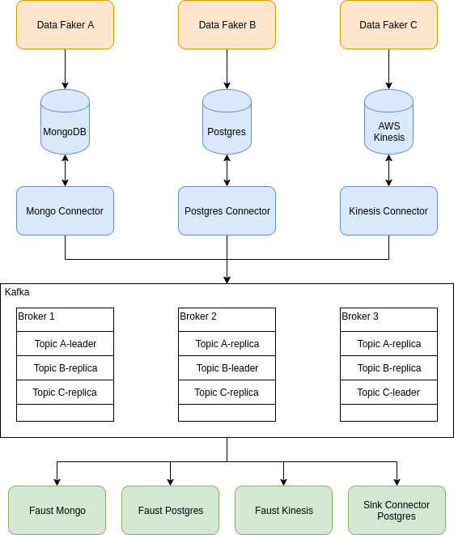

# Kafka Playground with Python

## Requirements
- Python 3.7
- Docker

## PoC Architecture

## To run Kafka local:
- `docker-compose up -d --build`

## Additional preparation
- For Mongo consumer, you need to change your Mongo configuration from direct connection to replication set. Detail reason on [here](https://docs.confluent.io/current/connect/debezium-connect-mongodb/index.html#configure-a-replication-mechanism-on-mongodb). To make things simpler, you can use the free tier of Mongo Atlas and replace the mongoDB credential. (It will not be run by using the existing credential. Need to whitelist IP)
- For Postgres consumer, you need to enable logical decoding feature. Detail explanation on [here](https://debezium.io/documentation/reference/1.0/connectors/postgresql.html)

## To run source-mongo:
- `cd source-mongo`
- `virtualenv -p <which python> venv`
- `source venv/bin/activate`
- `pip install -r requirement.txt`
- `python database.py`

## To run source-postgres:
- `create new database > run all sql statement on migration folder`
- `cd source-postgres`
- `virtualenv -p <which python> venv`
- `source venv/bin/activate`
- `pip install -r requirement.txt`
- `python database.py`

## To run source-kinesis:
- `cd source-kinesis`
- `virtualenv -p <which python> venv`
- `source venv/bin/activate`
- `pip install -r requirement.txt`
- `python kinesis.py`

## To run connector:

## To run consumer:

## Resources:
- [Tutorial: Simulate AWS Kinesis in local environment](https://blog.ruanbekker.com/blog/2019/06/22/play-with-kinesis-data-streams-for-free/)
- [Tutorial: Create a Docker Image containing Confluent Hub COnnectors](https://docs.confluent.io/current/connect/managing/extending.html#create-a-docker-image-containing-c-hub-connectors)
- [Tutorial: Kafka connect with Mongo Atlas cluster](http://blog.naver.com/PostView.nhn?blogId=nomadgee&logNo=221293115096&redirect=Dlog&widgetTypeCall=true&directAccess=false)
- [Source: Create fake data](https://faker.readthedocs.io/en/latest/index.html)
- [Source: List of supported connector types](https://docs.confluent.io/current/connect/managing/connectors.html)
- [Source: Kafka Connect - Debezium Mongo Connector configuration list](https://docs.confluent.io/current/connect/debezium-connect-mongodb/mongodb_source_connector_config.html)